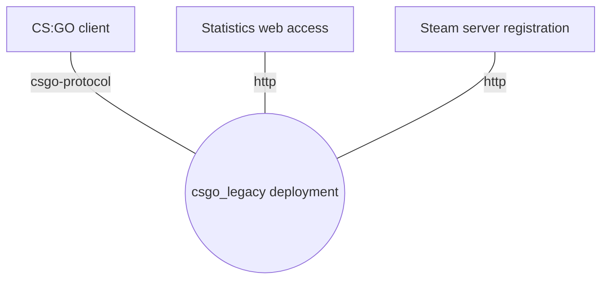
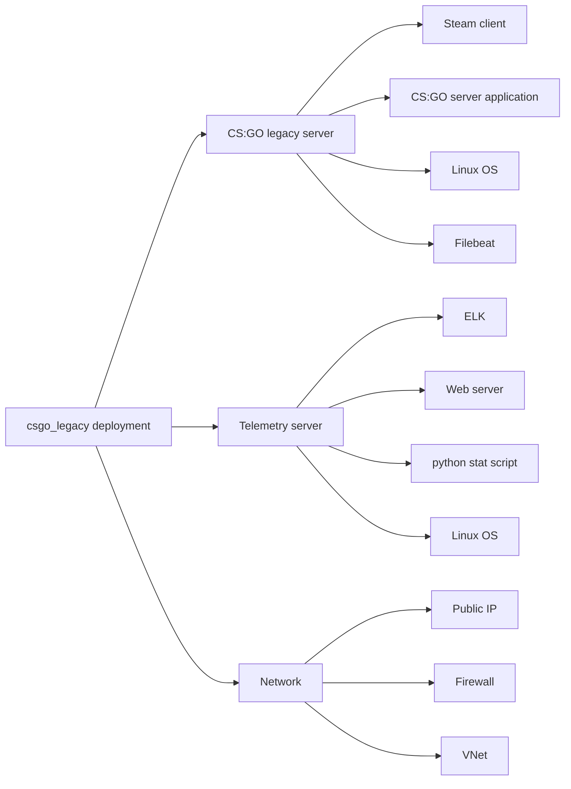

# CS:GO legacy server

## Introduction

### Purpose

Provide the tools and documentation to deploy a private CS:GO server.

In Azure and docker.

### Vocabulary

* CLI - command line interface.
* csgo - Counter Strike Global Offence.
* GSLT - Game Server Login Token.
* steamcmd - steam CLI client

### References

* [Register game server](https://steamcommunity.com/dev/managegameservers)
* [How to Make a Counter-Strike: Global Offensive Server on Linux](https://www.hostinger.com/tutorials/how-to-make-a-csgo-server)
* [forum - Source Dedicated Server (Linux)](https://steamcommunity.com/discussions/forum/14/)
* [SteamCMD Error Codes](https://github.com/GameServerManagers/LinuxGSM-Docs/blob/master/steamcmd/errors.md)
* [Source Dedicated Server](https://developer.valvesoftware.com/wiki/Source_Dedicated_Server)
* [Forum - Counter-Strike: Global Offensive](https://steamcommunity.com/app/730/discussions/)
* [debian csgo docker image](https://hub.docker.com/r/cm2network/csgo/)
* [SteamCMD](https://developer.valvesoftware.com/wiki/SteamCMD)
* [ELK stack for CSGO](https://github.com/CypressXt/elk4csgo)
* [Counter-Strike: Global Offensive - Dedicated Servers](https://developer.valvesoftware.com/wiki/Counter-Strike:_Global_Offensive/Dedicated_Servers)
* [CFG files](https://developer.valvesoftware.com/wiki/CFG)
* [Game Modes](https://developer.valvesoftware.com/wiki/Counter-Strike:_Global_Offensive/Game_Modes)
* [Map list](https://developer.valvesoftware.com/wiki/Counter-Strike:_Global_Offensive/Maps)
* [Access rcon on server](https://mcprohosting.com/billing/knowledgebase/325/How-to-Use-RCON-on-a-Counter-Strike-GO-Server.html)
* [Counter-Strike: Global Offensive Maps](https://liquipedia.net/counterstrike/Portal:Maps)
* [Running a Counter Strike Global Offensive Server on Ubuntu 18.04](https://www.linode.com/docs/guides/launch-a-counter-strike-global-offensive-server-on-ubuntu-18-04/)
* [Installing a CS:GO Dedicated Server in Ubuntu](https://medium.com/@oritromax/installing-a-cs-go-dedicated-server-in-ubuntu-ed37377b06d1)

### Installing the CS:GO client

* Start steam
* find Counter Strike in the Store
* Add counter strike to your library
* in the library
* right click on the game
* select Properties
* Click Betas (in the left ribbon)
* In the 'Beta Participation' drop-down, select 'csgo_legacy - Legacy Version of CS:GO'
  * the download might start automatically or you may need to start the update manually

### Connecting to the server from the client

* pull down the console
* type in:
  * password SERVER_GAME_PASSWORD
    * sv_password in the autoexec.cfg on the server
  * connect IP_ADDRESS

### Overview

#### Context diagram

Entity                    | Type      | Description | Reference
------------------------- | --------- | ----------- | ---------
CS:GO client              | Adjacant  | The CS:GO runing on the gamers machine | X
Statistics web access     | Adjacant  | Web browser  | X
Steam server registration | Adjacant  | For getting the server token | X
csgo_legacy deployment    | TheWork   | This project | X
csgo-protocol             | Connector |                       | 
http                      | Connector |                       | 

#### Module decomposition

## Deployment

## CSGO configuration

### Files of interest

* autoexec.cfg - [This file is executed before the first map starts.](https://developer.valvesoftware.com/wiki/Counter-Strike:_Global_Offensive/Dedicated_Servers#autoexec.cfg)
* server.cfg - [This file is executed every map change, and before the gamemode files.](https://developer.valvesoftware.com/wiki/Counter-Strike:_Global_Offensive/Dedicated_Servers#server.cfg)
* gamemodes_server.txt - [This file allows the server administrator to customize each game mode for their own server. It overrides and defaults set by Valve in gamemodes.txt.](https://developer.valvesoftware.com/wiki/Counter-Strike:_Global_Offensive/Dedicated_Servers#gamemodes_server.txt)
* gamemode_casual_server.cfg - [used for overriding the configurations that valve have put into gamemode_casual.cfg](https://developer.valvesoftware.com/wiki/Counter-Strike:_Global_Offensive/Dedicated_Servers#gamemode_casual_server.cfg)

### Maps

* Map name prefix seems to indicate the type of game it becomes
  * cs_ - Hostage/Rescue (original counter-strike mode)
  * de_ - demolition? or is it deathmatch?
  * ar_ - arms race?
  * dz_ - dangerzone

* TODO can I use this command to switch mode? `map <mapname> survival`
  * changelevel dz_blacksite survival

* You can mix rescue and demolition, but not arms race.

### Parameters of interest

* mp_maxrounds
  * 5 ?
  * set the win limit to the same
* mp_friendlyfire
* mp_roundtime
* mp_timelimit
* mp_allowNPCs
* mp_teams_unbalance_limit
* mp_respawnwavetime
* mp_roundtime_hostage
* mp_freezetime
  * 6
    * seconds from start of game until you can move, gives older players some help.
  * 10 seconds feels too long.
* ?? warmuptime, 60
  * to give slower load machines a change to get in, until the game actually starts.
* mp_disable_respawn_times
* mp_disable_respawn_times
* mp_friendlyfire
* mp_limitteams
* mp_teamplay
* mp_autoteambalance
